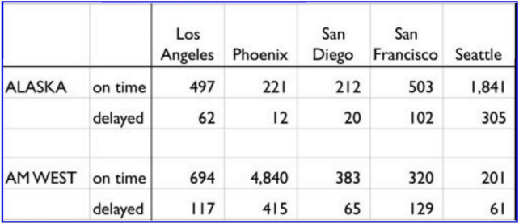

```{r setup, include=FALSE}
knitr::opts_chunk$set(echo = TRUE)
library("tidyr")
library("dplyr")
```

## Problem
Given the data set below, tidy and reshape the data to compare arrival and departure times between the two airlines.


## Creating the CSV File
First, I created a CSV file representing the data pictured above.  I assumed each cell of the table shown was a value to be represented in the CSV file, with blank cells representing an empty value.  The resulting file is:


## Reading and initial processing of the CSV Data
Reading the initial file is easy, since R has a function to do so.
```{r readfile}
airline_df <- read.csv("Airline.csv")
print(airline_df)
```

Looking at the dataframe, we notice that the column headers for the airline and the status of the observations are not meaningful, so we shall rename them:
```{r add_header}
names(airline_df)[1] <- "Airline"
names(airline_df)[2] <- "Status"
print(airline_df)
```

We also notice that, for the "delayed" data observations, we do not have the airline associated with those observations listed, so let us change that as well:
```{r add_airline}
airline_df[2,1] <- airline_df[1,1]
airline_df[4,1] <- airline_df[3,1]
print(airline_df)
```

## Separating the data into various useful frames
# Lengthening Data
First, we can lengthen the data table so that each row contains the Airline, Status of Flight, City of flights, and # of flights of that type:  
```{r lengthen_data}
long_df <- airline_df %>%
                  gather("Location", "n",3:7)
print(long_df)
```

# By Airline
```{r by_airline}
# Filter observation by airline
alaska_df <- long_df %>% filter(Airline == "Alaska") %>% group_by(Location)
amwest_df <- long_df %>% filter(Airline == "AM West") %>% group_by(Location)
print(alaska_df)
print(amwest_df)
```
Total number of flights to each location by each airline
```{r total_flights}
alaska_total <- alaska_df %>% group_by(Location) %>% summarise(total = sum(n))
amwest_total <- amwest_df %>% group_by(Location) %>% summarise(total = sum(n))
print(alaska_total)
print(amwest_total)
```
# By On time Flights
```{r by_ontime}
# On-time flights
ontime_df <-
  long_df %>%
  filter(Status == "on time") %>%
  select(-Status) %>%
  group_by(Location)
print(ontime_df)
```

# By Delayed Flights
```{r by_delayed}
delayed_df <-
  long_df %>%
  filter(Status == "delayed") %>%
  select(-Status) %>%
  group_by(Location)
print(delayed_df)
```